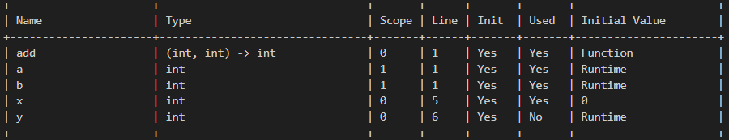
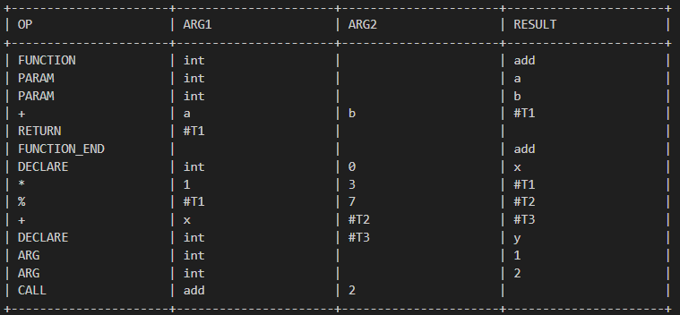

# Mellow Programming Language

Mellow is a statically-typed programming language compiler with C-like syntax. With some key features including:
-	Data Types: int, float, char, bool, string, void.
-	Variables & Constants:
    -	Variable declaration: int x = 5;
    -	Constants: const int max = 100; (can’t be changed later)
-	Control Structures:
    -	if-else, while, do-while, for loops, switch-case.
-	Functions: Support for parameters with default values.
-	Error Handling: Syntax and semantic checks (e.g., type mismatch, redeclaration).
-	Code Generation: Generate quadruples that map to the code.

## Symbol Table Structure

For the following simple test program:  
```
    int add(int a, int b)
    {
        return a + b;
    }
    int x = 0;
    int y = x + 1 * 3 % 7;
    add(1, 2);
```



## Quadruples 

For the same test program:  



## Error Handling 
-	Variable / Function redeclaration
-	Type mismatching in assignment / function call / return
-	Accessing undeclared variables / functions
-	Using uninitialized variables
-	Passing wrong parameters in a function call
-	Having a non-default parameter after a default one
-	break/continue/return not in their correct scopes
-	Non-void functions having no return
-	Assigning to constant 


## How to run
### 1.	Through the app
You will find a full stand-alone mellow.exe within the project folder, you can also generate a new one after any updates through:  
Pip install pyinstaller  
cd ./gui  
pyinstaller --onefile --noconsole --add-binary "../mellow.exe;." mellow.py  

### 2.	Through the GUI
cd ./gui  
python ./mellow.py

### 3.	Through the terminal
To run through the terminal, you can use script.sh attached or run the following commands directly:  
bison -d parser.y  
flex lexer.l    
g++ -o mellow parser.tab.c lex.yy.c value.cpp symbol.cpp quadruples.cpp  
./mellow.exe input.mel  

